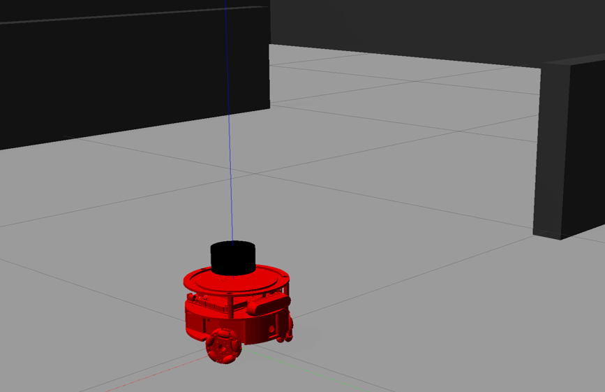
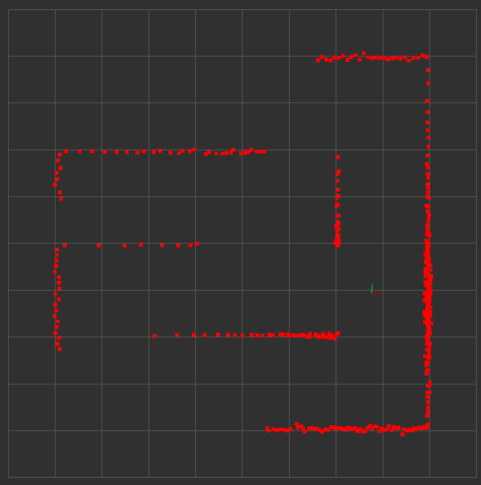
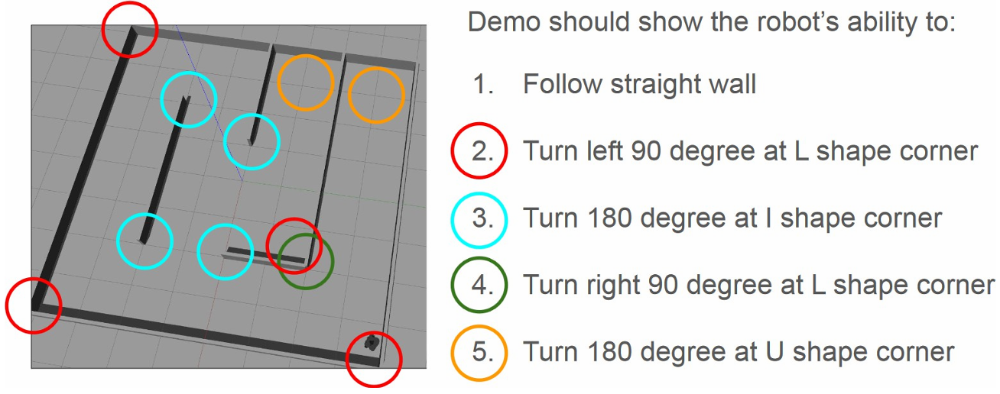
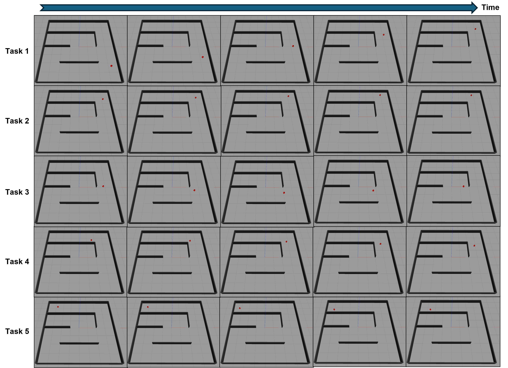
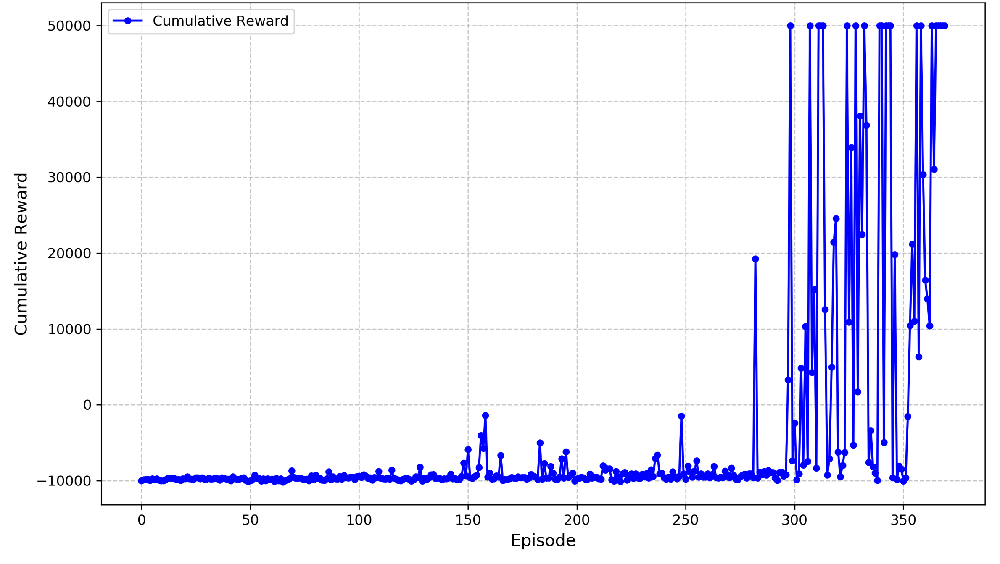
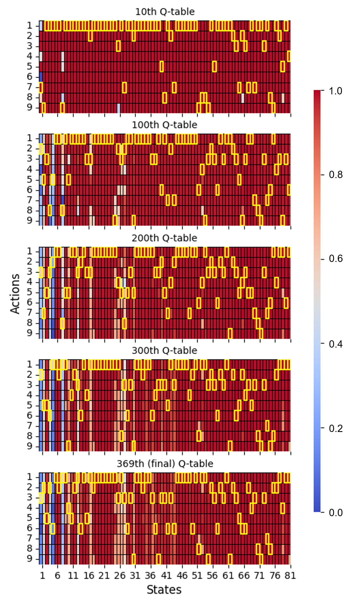
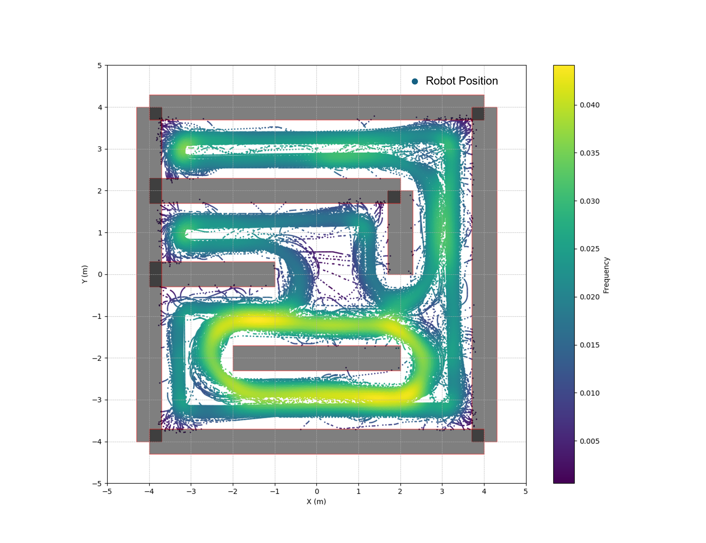

# Solving the Mobile Robot Wall-Following Problem by Q-Learning
[Report Link](Project_Report_XinleiZhang.pdf)
[Video Demo Link on Youtube](https://www.youtube.com/watch?v=ZRmKbzKZuLU)
## Triton Robot
Triton Robot
<figure markdown>
  { width="800" }
  <figcaption>Visualization of the Triton robot in Gazebo</figcaption>
</figure>  

LiDAR measurement in RViz
<figure markdown>
  { width="1000" }
  <figcaption>LiDAR measurement visualization in RViz</figcaption>
</figure>  

## Problem description
<figure markdown>
  { width="1000" }
  <figcaption>Overview of wall-following and corner-turning tasks.</figcaption>
</figure>  

## Results Demo

### Tasks Evaluation

Video demo of naviating through stright wall and negotiating corners of different corners
<video controls>
<source src="../wall_following_video_demo.mp4" type="video/mp4">
</video>

Performance of the learned Q-table on various wall-following tasks
<figure markdown>
  { width="1000" }
  <figcaption>Performance of the learned Q-table on various wall-following tasks</figcaption>
</figure>  

### Learning Results

Cumulative reward versus episode.
<figure markdown>
  { width="800" }
  <figcaption>Cumulative reward versus episode.</figcaption>
</figure>  

Evolution of the Q-table during learning
<figure markdown>
  { width="800" }
  <figcaption>Evolution of the Q-table during learning; the highest Q-value for each state is highlighted.</figcaption>
</figure>  

Robot trajectory during learning
<figure markdown>
  { width="800" }
  <figcaption>Robot trajectory during learning; light colors indicate high-frequency regions, while dark colors represent low-frequency areas.</figcaption>
</figure>  
