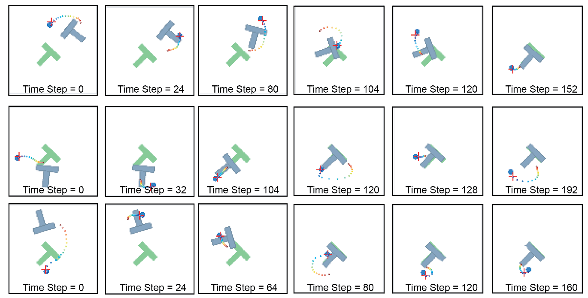
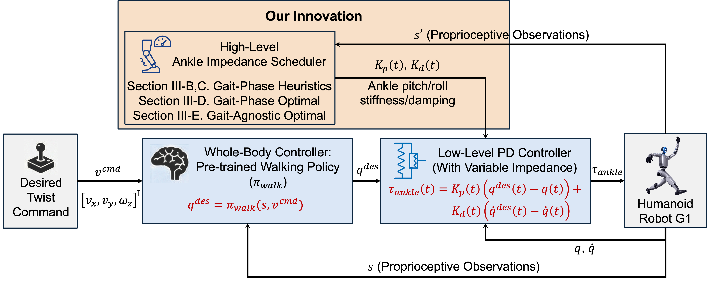
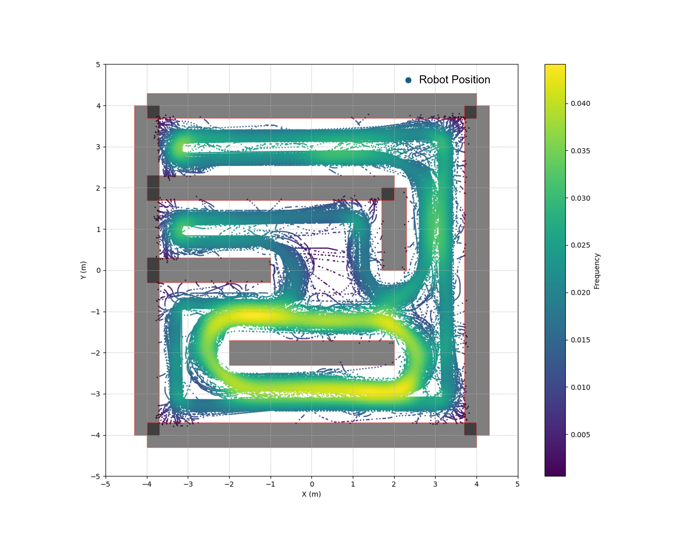
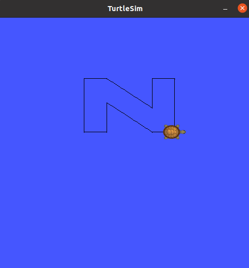
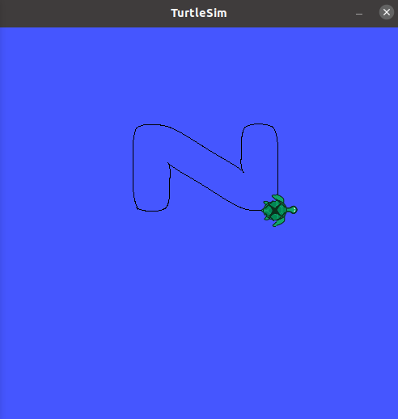

# Course Projects

### ECE 572 - Fall 2025: Learning-Based Stochastic Optimization for Robotics: Diffusion Policy

Please [click here](https://github.com/GuanQinG-GitHub/XinleiZhang_Website/blob/main/docs/Course_Projects/NCSU/ECE572-2025Fall/Report.pdf) to access the full report.

<figure markdown>
  { width="1000" }
  <figcaption>Diffusion Policy for Push-T Task. Three rows indicate three initializations</figcaption>
</figure>  

<figure style="flex: 1;">
<video controls autoplay muted width="100%">
<source src="NCSU/ECE572-2025Fall/denoising_step_0.mp4" type="video/mp4">
</video>
<figcaption>TimeStep0</figcaption>
</figure>

<figure style="flex: 1;">
<video controls autoplay muted width="100%">
<source src="NCSU/ECE572-2025Fall/denoising_step_24.mp4" type="video/mp4">
</video>
<figcaption>TimeStep24</figcaption>
</figure>

<figure style="flex: 1;">
<video controls autoplay muted width="100%">
<source src="NCSU/ECE572-2025Fall/denoising_step_80.mp4" type="video/mp4">
</video>
<figcaption>TimeStep80</figcaption>
</figure>

### MAE 589 - Fall 2025: Variable-Impedance Optimal Ankle Joint Controller for Humanoid Walking
<figure>
<video controls autoplay muted width="80%">
<source src="NCSU/MAE589-2025Fall/G1_pretrain_uneven_terrain.mp4" type="video/mp4">
</video>
<figcaption>Demonstration of the Humanoid Walking on Uneven Terrain with Our Variable-Impedance Ankle Controller</figcaption>
</figure>

<figure markdown>
  { width="1000" }
  <figcaption>Block Diagram of the Variable-Impedance Ankle Joint Controller</figcaption>
</figure>  

### CSC 791 - Spring 2025: Navigation on Triton Robut

#### Navigation via Adaptive Monte Carlo Localization and Model-Predictive Path-Integral Control
<iframe src="https://www.youtube.com/embed/eCKnlYAgZUE" allowfullscreen width="100%" height="450" frameborder="0"></iframe>

#### Solving the Mobile Robot Wall-Following Problem by Q-learning
<figure>
<video controls autoplay muted width="80%">
<source src="NCSU/CSC791-2025Spring/Q-Learning/wall_following_video_demo.mp4" type="video/mp4">
</video>
<figcaption>Demonstration of the Wall-Following via Q-Learning</figcaption>
</figure>

<figure markdown>
  { width="1000" }
  <figcaption>Training Process of Q-Learning</figcaption>
</figure>  

#### TurtleBot Trajectory Tracking by MPC

<figure style="flex: 1;">
  
  <figcaption>Reference Trajectory - N Shape</figcaption>
</figure>

<figure style="flex: 1;">
  
  <figcaption>Trajectory Tracking by MPC</figcaption>
</figure>

### MAE 589 - Fall 2024: Point-to-point Kinematic Control of the 3-Joint Robotic Arm in the Presence of Obstacles
<figure>
<video controls autoplay width="80%">
<source src="NCSU/MAE589-2024Fall/3D_View_MPC.mp4" type="video/mp4">
</video>
<!-- <figcaption>Point-to-point Kinematic Control of the 3-Joint Robotic Arm in the Presence of Obstacles</figcaption> -->
</figure>

### Spring 2023: Hand Exoskeleton
<iframe src="//player.bilibili.com/player.html?aid=399365953&bvid=BV1eo4y1u7Z5&cid=1148102749&page=1&high_quality=1&danmaku=0" allowfullscreen="allowfullscreen" width="100%" height="450" scrolling="no" frameborder="0" sandbox="allow-top-navigation allow-same-origin allow-forms allow-scripts"></iframe>

Or [click here](https://www.bilibili.com/video/BV1eo4y1u7Z5/?share_source=copy_web&vd_source=6e25c0ee215551350286d8e6cebc616d) to watch the 1080P video in bilibili.

### Fall 2022: Rotating Elves
<iframe src="//player.bilibili.com/player.html?aid=568567706&bvid=BV1Uv4y177sV&cid=1055932123&page=1&high_quality=1&danmaku=0" allowfullscreen="allowfullscreen" width="100%" height="450" scrolling="no" frameborder="0" sandbox="allow-top-navigation allow-same-origin allow-forms allow-scripts"></iframe>

Or [click here](https://m.bilibili.com/video/BV1Uv4y177sV?spm_id_from=444.41.list.card_archive.click&vd_source=512a29abd51aa6480c37da093c986db1) to watch the 1080P video in bilibili.

