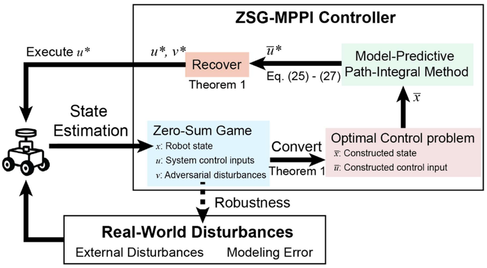
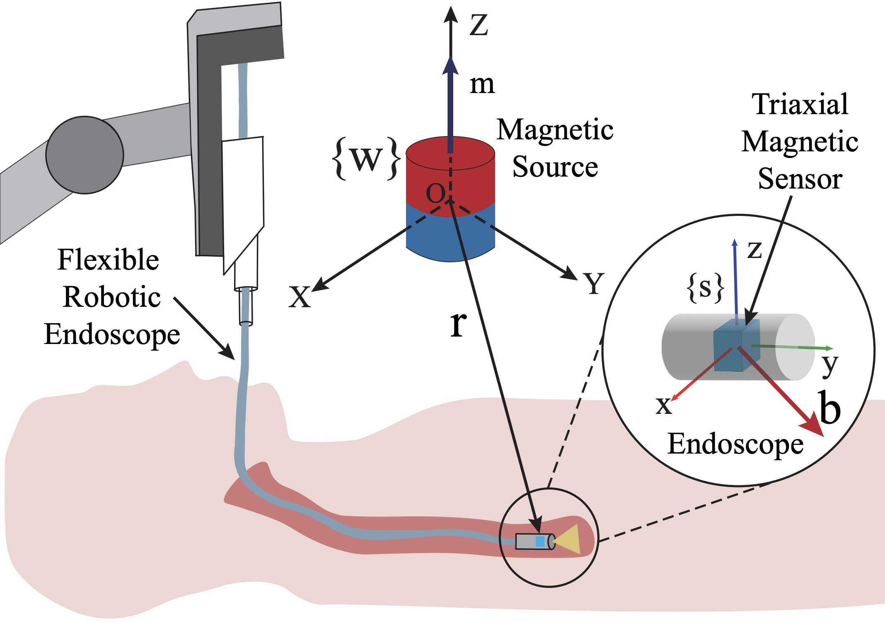
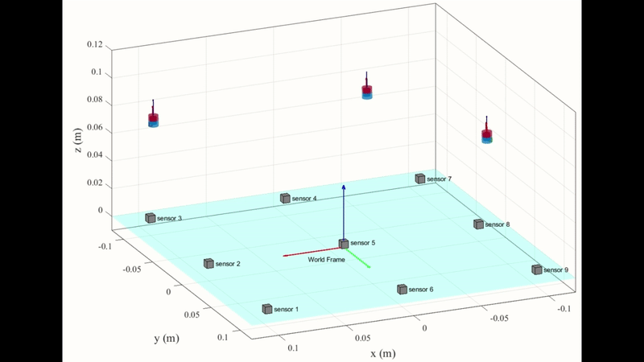

# Publications
Please see my [Google Scholar](https://scholar.google.com/citations?user=ztAdTAoAAAAJ&hl=en&oi=ao) for more details.

## ZSG-MPPI: Robust Model-Predictive Path-Integral Method for Disturbance Handling
<figure markdown>
  { width="500" }
  <figcaption> Illustration of the architecture of the ZSG-MPPI method</figcaption>
</figure>  

<iframe src="https://www.youtube.com/embed/SEYBzZ-iOJU" allowfullscreen width="100%" height="450" frameborder="0"></iframe>

## On Ambiguity in 6-DoF Magnetic Pose Estimation

### Illustration of the Electromagnetic Tracking System
<figure markdown>
  { width="500" }
</figure>  

### Pose Tracking of a Continuum Robot with the Tri Magnet System 
<iframe src="https://www.youtube.com/embed/ZFi194aNm1Y" allowfullscreen width="100%" height="450" frameborder="0"></iframe>

### Pose Tracking against Environmental Mangetic Disturbances in a Confined Cardiovascular Phantom
<figure>
<video controls autoplay muted width="80%">
<source src="Ambiguity/Video6_Pose_Tracking_against_Environmental_Mangetic_Disturbances.mp4" type="video/mp4">
</video>
</figure>

## Simutaneously Pose Tracking of 3 Free-Moving Permanent Magnets with a Stationary 9-Sensor-Array
<figure markdown>
  { width="1000" }
</figure>

